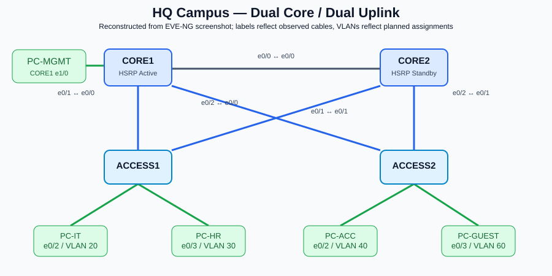

# Enterprise Network Design & Implementation | EVE-NG

> **Status:** Sprint 0 — Foundation & Design (technical validation complete; documentation closeout pending).  
> **Last documentation update:** 2026-10-09  
> **Lab platform:** EVE-NG Community 6.2 on VMware Workstation

A hands-on **multi-site enterprise network lab** to practice campus switching, routing, redundancy, perimeter security, site-to-site connectivity, infrastructure services, monitoring and automation. The project is developed incrementally by **Sprint → Story → Implementation → Verification → Evidence**.

This repository describes an **educational simulation**, not a production network. Planned features are explicitly separated from tested features.

## Verified foundation (Sprint 0)

- EVE-NG VM: **4 vCPU, 7.7 GiB visible RAM, ~100 GiB free disk** when checked.
- IOSv lab: R1 (`10.255.0.1/30`) reached R2 (`10.255.0.2/30`); first ping **4/5 replies** (initial ARP resolution is a possible explanation; not independently verified).
- Cisco IOL L2 image accepted `ip routing`, SVI and HSRP configuration.
- On VLAN 10: **CORE1** `10.10.10.2` (HSRP **Active**, priority **110**) and **CORE2** `10.10.10.3` (HSRP **Standby**, priority **100**) use VIP `10.10.10.1`.
- HQ campus topology contains dual-homed ACCESS1/ACCESS2 and 4 departmental VPCS; PC-MGMT is temporarily attached directly to CORE1.
- Cisco ASAv and Alpine Linux are part of the environment; their boot/service evidence should be archived before formal Sprint 0 sign-off.

**Not yet confirmed as implemented:** department VLANs 20–60, RSTP tuning, LACP, inter-VLAN end-to-end tests, WAN/branch routing, BGP, ACL/NAT/firewall policies, VPN, monitoring and automation.

## Target architecture

- **HQ:** CORE1 / CORE2, ACCESS1 / ACCESS2, Management, IT, HR, Accounting, Server and Guest VLANs.
- **Edge and security (planned):** EDGE1 / EDGE2, two simulated ISPs, Cisco ASAv and DMZ.
- **Branches (planned):** Branch 1, Branch 2 with secure connectivity to HQ.
- **Services (planned):** Alpine Linux for DHCP, DNS, NTP and Syslog; later SNMP monitoring and Python/Ansible automation.

> Figure: diagram reconstructed from the supplied HQ EVE-NG screenshot. Full-site diagrams remain pending.

## Documentation

| Resource | Purpose |
|---|---|
| [Documentation index](docs/README.md) | Navigate technical documents |
| [Architecture & interface map](docs/network-architecture.md) | Current HQ topology, roles and expansion plans |
| [IP addressing plan](docs/ip-addressing-plan.md) | HQ IPs and proposed Branch/DMZ/WAN networks |
| [Sprint 0 technical test results](docs/test-results/sprint-00-validation.md) | Captured and reported lab evidence |
| [Sprint 0 report](docs/sprint-reports/sprint-00-report.md) | Sprint review, outcomes, gaps, next actions |
| [Original project roadmap](docs/enterprise-network-design-implementation-roadmap.md) | Sprint / Epic / Story reference |

## Project roadmap

| Sprint | Focus | Status |
|---:|---|---|
| 0 | Foundation, design, repository | **Review / documentation closeout** |
| 1 | Campus switching: VLAN, Trunk, SVI, RSTP | Next |
| 2 | EtherChannel/LACP, HSRP high availability | Planned (HSRP proof-of-concept in Sprint 0) |
| 3 | OSPF routing | Planned |
| 4 | Internet edge, BGP, dual ISP | Planned |
| 5 | ACL, NAT, Firewall, DMZ | Planned |
| 6 | Site-to-Site IPSec VPN | Planned |
| 7 | Alpine Linux infrastructure services | Planned |
| 8 | Monitoring | Planned |
| 9 | Network automation | Planned |
| 10 | Troubleshooting scenarios | Planned |
| 11 | Portfolio & final documentation | Planned |

## Lab stack

- VMware Workstation; EVE-NG Community 6.2 (VM configured with 8 GB RAM / 4 vCPU / 120 GB disk).
- Cisco IOSv (`vios-adventerprisek9-m-15.6.2T`) for routers.
- Cisco IOL L2 (`L2-ADVENTERPRISEK9-M-15.2-IRON-20151103`) for campus switches and validated SVI/HSRP proof-of-concept.
- Cisco ASAv (image available/installed); Alpine Linux (lighter substitute for roadmap's Ubuntu Server); VPCS.

## Repository conventions

- Default branch observed on GitHub: **`master`** (do not assume `main`).
- Proposed workflow: `feature/NET-<id>-<topic>` → Pull Request → `master` after verification.
- Preserve sanitized device configurations, reproducible tests and screenshots alongside docs.
- **Never publish** proprietary VM images, passwords, PSKs, private keys, tokens or active production secrets.

## License / disclaimer

Educational lab documentation. Vendor names are used solely to describe simulated network components. No Cisco/third-party image binaries are distributed here.