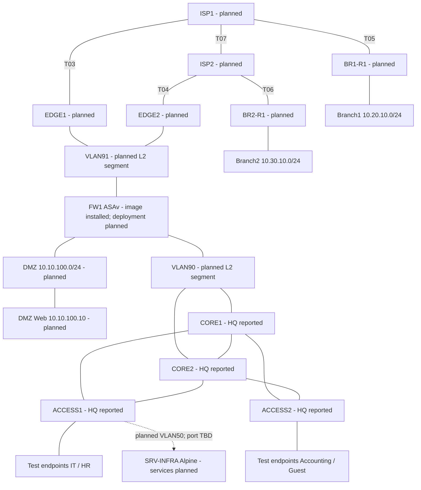

# Topology logic — thiết kế dự kiến v1.0

**Ngày review:** 10/10/2026

**Nguồn:** [Architecture](../docs/network-architecture.md) và [IP Plan](../docs/ip-addressing-plan.md).

**Trạng thái:** thiết kế đã review khi đóng Sprint 0. HQ đối chiếu ảnh/export tám node/chín link; WAN, firewall policy, Branch và services là planned. Sơ đồ không chứng minh mọi node đã chạy hoặc forwarding đúng.

## Cách đọc

- Các đường mô tả quan hệ kết nối dự kiến; trạng thái forwarding/trunk/shutdown phải được kiểm tra riêng.
- VLAN10/20/30/40/50/60 dùng SVI trên hai Core, gateway HSRP theo IP Plan. Native VLAN99 không cấp IP.
- VLAN90 nối hai Core với FW inside; VLAN91 nối FW outside với hai Edge. Mỗi vùng cần broadcast domain chung, chưa chốt node Layer 2/cổng cụ thể.
- SRV-INFRA dự kiến nối Access qua VLAN50; lựa chọn Access/cổng phải chốt trong physical topology trước Sprint 7. Đường tới ACCESS1 trong sơ đồ là đề xuất, chưa xác nhận cabling.
- DMZ gateway nằm ở FW1, không trên Core. Test endpoints là VPCS linh động, không phải hạ tầng cố định.
- VPN HQ–Branch là lớp kết nối dự kiến qua ISP; chưa vẽ tunnel endpoint cố định vì quyết định terminate ở FW/Edge còn mở tại WAN-01.

## Điểm còn mở

Gateway outside của ASA và failover; default/return routes; OSPF Branch đi trên đường nào; VPN/NAT placement; Internet Test Server và cổng/server DMZ. Theo dõi tại [WAN-01](../docs/sprint-reports/sprint-00-closeout.md#3-việc-chuyển-tiếp-và-điều-kiện-thực-hiện).
